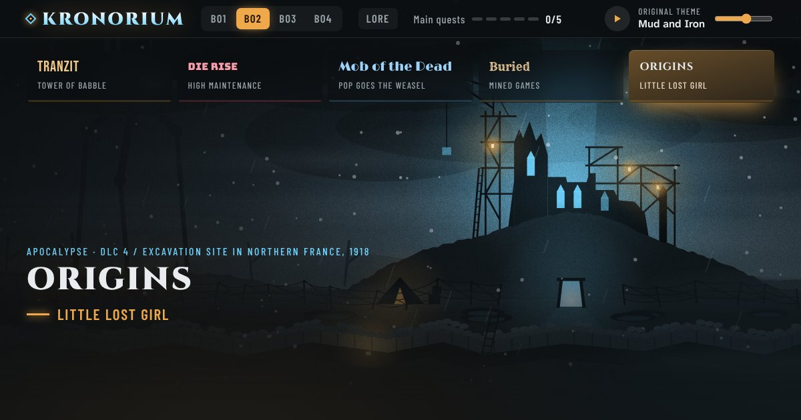

# Kronorium: Zombies Easter Egg Companion

**[Open the site →](https://eclipsegs27.github.io/Ultimate-Zombies-Easter-Egg-Companion/)**

A free companion for Call of Duty Zombies main quest easter eggs: every map in the Aether story (Black Ops 1 to Black Ops 4) and the Dark Aether story (Cold War, Vanguard, Black Ops 6 and Black Ops 7). Pick a map, follow the steps, tick them off as you go, and watch a short clip of any step you're stuck on instead of scrubbing through a 40 minute guide.

No ads, no sign-up, nothing to install. It works on a phone, so you can keep it open next to the TV.

## What's on it

- **Step-by-step checklists** for the main quest on every map, split into sections like power, gear, wonder weapons and the boss fight. Many maps also list their side easter eggs.
- **Video clips for most steps.** Open a step and its clip starts right where that step begins in a full guide, and stops where the next one starts. When it ends, one tap plays the next step. The full guide sits at the top of each map.
- **Progress tracking.** Your ticks are saved in your browser, so you can close the page and pick up where you left off.
- **Search** within a map to jump to a step.
- **Lore pages** for each storyline, with a timeline of the crews, worlds and events.
- **A completion screen** themed to each map's finale when you finish its quest.

## Maps

The tabs at the top of the site switch between the two storylines.

**Aether Story** (including Chaos)

| Game | Maps |
| --- | --- |
| Black Ops | Ascension, Call of the Dead, Shangri-La, Moon |
| Black Ops II | TranZit, Die Rise, Mob of the Dead, Buried, Origins |
| Black Ops III | Shadows of Evil, The Giant, Der Eisendrache, Zetsubou No Shima, Gorod Krovi, Revelations |
| Black Ops 4 | Voyage of Despair, IX, Blood of the Dead, Classified, Dead of the Night, Ancient Evil, Alpha Omega, Tag der Toten |

**Dark Aether Story**

| Game | Maps |
| --- | --- |
| Black Ops Cold War | Die Maschine, Firebase Z, Outbreak, Mauer der Toten, Forsaken |
| Vanguard | Der Anfang, Terra Maledicta, Shi No Numa, The Archon |
| Black Ops 6 | Liberty Falls, Terminus, Citadelle des Morts, The Tomb, Shattered Veil, Reckoning |
| Black Ops 7 | Ashes of the Damned, Astra Malorum, Paradox Junction, Totenreich, Kowakujō, Rex Infernus |

## Still in progress

- Most steps have a clip, but some don't yet. Those steps still have written instructions.
- The Giant has no guide video yet.

## Credits

The videos are embedded straight from YouTube, so every view goes to the people who made them. Most come from [MrRoflWaffles](https://www.youtube.com/@MrRoflWaffles), with NoahJ456 and other creators filling in where he has no guide. Each map lists the written guides and wiki pages its steps were checked against.

Kronorium is a fan project and isn't affiliated with Activision or Treyarch.

## Found a mistake?

With this many maps, something is bound to be off. If a step is wrong or missing, or a clip starts in the wrong place, [open an issue](https://github.com/EclipseGS27/Ultimate-Zombies-Easter-Egg-Companion/issues) with the map and step and it'll get fixed.

---

Maintainer notes (hosting, the video editor and publishing changes) are in [docs/EDITING.md](docs/EDITING.md).
